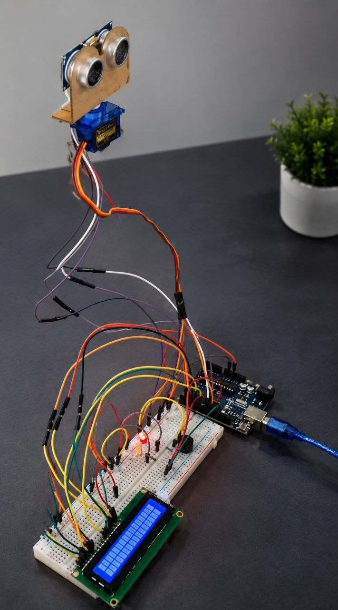
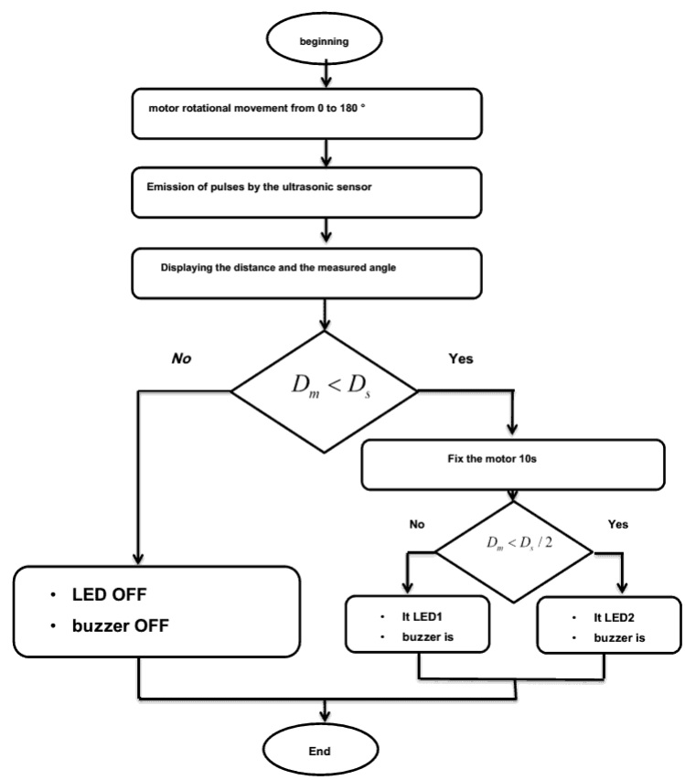
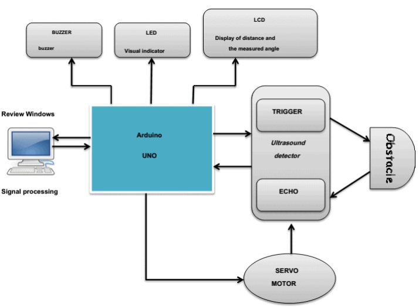
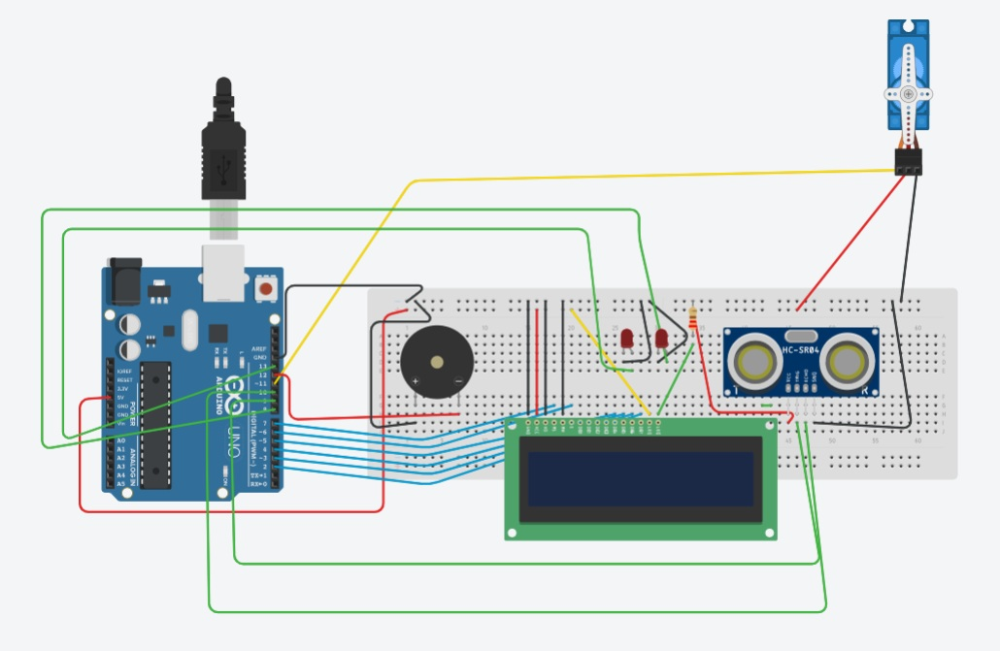

<h1 align="center">Mini Radar</h1>

<p align="center">
  
  
  
  
  
  
  
</p>

<p align="center">
  <strong>Arduino-based obstacle detection and ranging system using an HC-SR04 ultrasonic sensor, servo motor, LCD display, LEDs, and buzzer.</strong>
</p>

<p align="center">
  
</p>

<p align="center">
This project presents a compact radar-like obstacle detection system built with an Arduino UNO, an HC-SR04 ultrasonic sensor, and a servo motor. The sensor continuously scans a 180° field of view, measures the distance to nearby objects, displays the measured distance and scanning angle on an LCD, and activates LEDs and a buzzer to provide visual and audible obstacle alerts.
</p>

---

## Quick Navigation

**Overview** • **Key Features** • **Hardware Components** • **Project Structure** • **Working Principle** • **Block Diagram** • **Circuit Diagram** • **Hardware Prototype** • **Source Code** • **Technologies Used** • **License**

---

## Overview

The **Arduino Mini Radar** is an embedded systems project designed to detect nearby obstacles using ultrasonic sensing technology. The system combines an **Arduino UNO**, an **HC-SR04 ultrasonic sensor**, and a **servo motor** to perform continuous 180° environmental scanning.

As the servo motor rotates, the ultrasonic sensor measures the distance to surrounding objects at different angles. The measured distance and scanning angle are displayed on a **16×2 LCD**, while **LED indicators** and a **buzzer** provide real-time visual and audible alerts whenever an object is detected within predefined distance thresholds.
This project demonstrates the integration of sensors, actuators, embedded programming, and real-time monitoring concepts commonly used in robotics, automation, and obstacle detection applications.

## Key Features

- 📡 **180° Radar Scanning** using a servo motor for continuous environmental monitoring.
- 📏 **Real-Time Distance Measurement** with the HC-SR04 ultrasonic sensor.
- 🖥️ **LCD Display** showing the measured distance and current scanning angle.
- 🚨 **Obstacle Detection Alerts** using LEDs and a buzzer based on predefined distance thresholds.
- ⚙️ **Embedded System Implementation** built on the Arduino UNO platform.
- 🔄 **Continuous Object Monitoring** through automatic sensor sweeping and distance updates.
- 🧩 **Modular Hardware Design** integrating sensors, actuators, and display peripherals.

## Hardware Components

| Component | Description |
|-----------|-------------|
| **Arduino UNO** | Main microcontroller responsible for processing sensor data and controlling the system. |
| **HC-SR04 Ultrasonic Sensor** | Measures the distance to nearby obstacles using ultrasonic waves. |
| **SG90 Servo Motor** | Rotates the ultrasonic sensor to perform 180° environmental scanning. |
| **16×2 LCD Display** | Displays the measured distance and current scanning angle. |
| **Buzzer** | Provides an audible alert when an obstacle is detected within the warning range. |
| **LED Indicators** | Provide visual status indication based on the detected object distance. |
| **Breadboard & Jumper Wires** | Used for circuit prototyping and hardware connections. |
| **USB Power Supply** | Powers the Arduino UNO during operation. |

## Project Structure

```text
arduino-mini-radar/
│
├── README.md                 # Project documentation
├── LICENSE                   # MIT License
│
├── Arduino/
│   └── mini-radar.ino        # Arduino source code
│
└── images/
    ├── project.jpg           # Hardware prototype
    ├── working-flowchart.jpg # Project workflow
    ├── block-diagram.jpg     # System block diagram
    └── circuit-diagram.jpg   # Complete circuit schematic
```
## Working Principle

<p align="center">
  
</p>

The system operates through the following sequence:

1. The **servo motor** rotates the ultrasonic sensor across a **180° scanning range**.
2. At each angle, the **HC-SR04 ultrasonic sensor** transmits an ultrasonic pulse and measures the echo time to calculate the distance to nearby objects.
3. The calculated **distance** and **current scanning angle** are displayed on the **16×2 LCD**.
4. If an object is detected within predefined distance thresholds, the corresponding **LED indicators** and **buzzer** are activated to provide visual and audible alerts.
5. The servo continues scanning, allowing the system to perform **continuous real-time obstacle detection**.

## Block Diagram

<p align="center">
  
</p>

The block diagram illustrates the overall architecture of the Arduino Mini Radar system and the interaction between its hardware components.

- **Arduino UNO** serves as the central controller, coordinating all system operations.
- **HC-SR04 Ultrasonic Sensor** measures the distance to nearby objects.
- **SG90 Servo Motor** rotates the ultrasonic sensor to achieve a 180° scanning range.
- **16×2 LCD Display** presents the measured distance and current scanning angle.
- **LED Indicators** provide visual feedback based on obstacle proximity.
- **Buzzer** generates audible alerts when objects are detected within predefined warning distances.

Together, these components create a simple real-time obstacle detection system capable of continuously scanning its surroundings and notifying the user of nearby objects.

## Circuit Diagram

<p align="center">
  
</p>

The circuit diagram shows the electrical connections between the Arduino UNO and all peripheral components used in the system.

- The **HC-SR04 ultrasonic sensor** is connected to the Arduino for distance measurement.
- The **SG90 servo motor** is controlled by the Arduino to rotate the sensor across the scanning area.
- The **16×2 LCD** displays the measured distance and scanning angle in real time.
- **LED indicators** provide visual feedback based on the detected object distance.
- The **buzzer** generates audible alerts when an object is detected within predefined warning thresholds.

The Arduino UNO acts as the central controller, processing sensor measurements and coordinating all connected output devices to perform continuous obstacle detection.

## Hardware Prototype

<p align="center">
  
</p>

The Arduino Mini Radar system was successfully implemented and tested on real hardware. The prototype integrates an Arduino UNO, an HC-SR04 ultrasonic sensor mounted on an SG90 servo motor, a 16×2 LCD display, LED indicators, and a buzzer.

The assembled hardware demonstrates continuous 180° scanning, real-time distance measurement, obstacle detection, and immediate visual and audible feedback, validating the functionality of both the hardware and the embedded software.

## Source Code

The complete Arduino implementation is available in:

```text
Arduino/
└── mini-radar.ino
```

The source code is responsible for:

- Initializing the ultrasonic sensor, servo motor, LCD display, LEDs, and buzzer.
- Rotating the servo motor through a 180° scanning range.
- Measuring object distances using the HC-SR04 ultrasonic sensor.
- Displaying the current scanning angle and measured distance on the LCD.
- Activating LEDs and the buzzer based on predefined distance thresholds.
- Continuously repeating the scanning cycle to provide real-time obstacle detection.

## Technologies Used

| Category | Technologies |
|----------|--------------|
| **Programming Language** | C++ (Arduino) |
| **Development Platform** | Arduino IDE |
| **Microcontroller** | Arduino UNO |
| **Distance Sensor** | HC-SR04 Ultrasonic Sensor |
| **Actuator** | SG90 Servo Motor |
| **Display** | 16×2 LCD |
| **Alert System** | LEDs, Buzzer |
| **Embedded Programming** | Arduino Framework |
| **Electronics** | Breadboard Prototyping |
